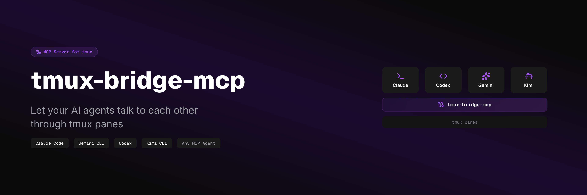
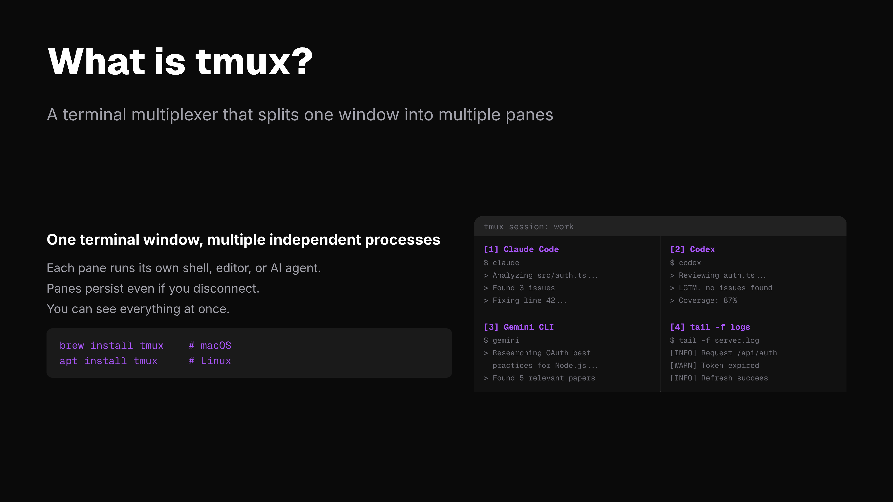
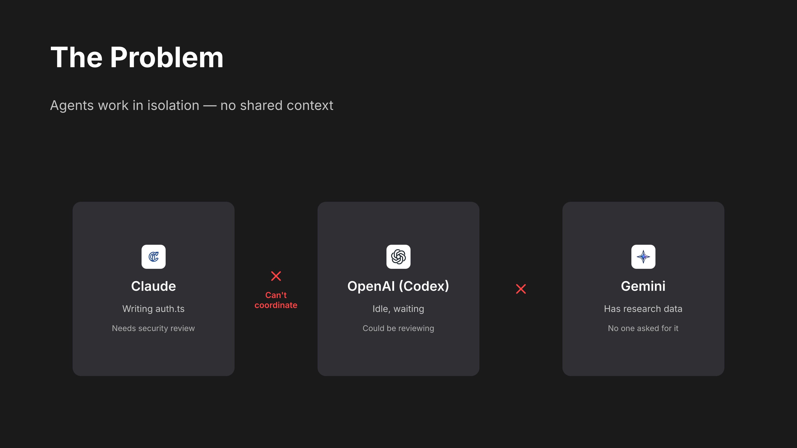
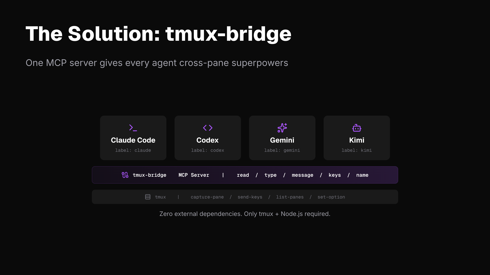
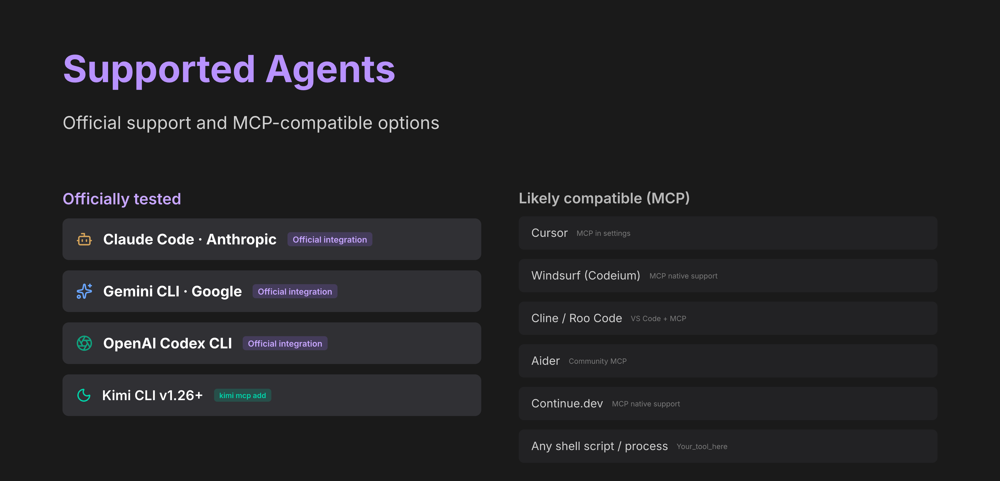
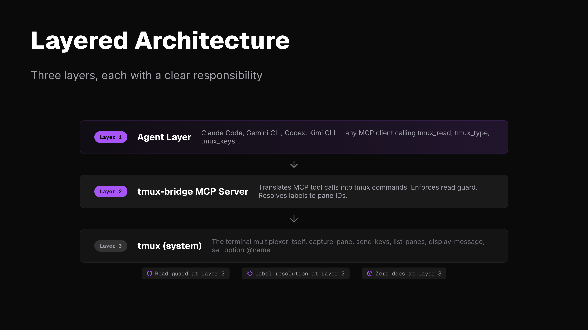
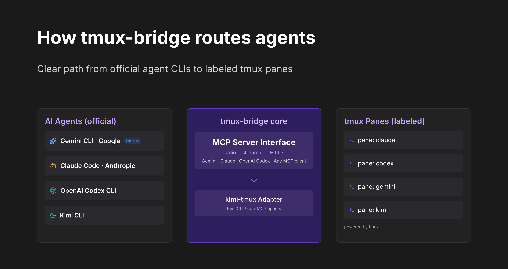
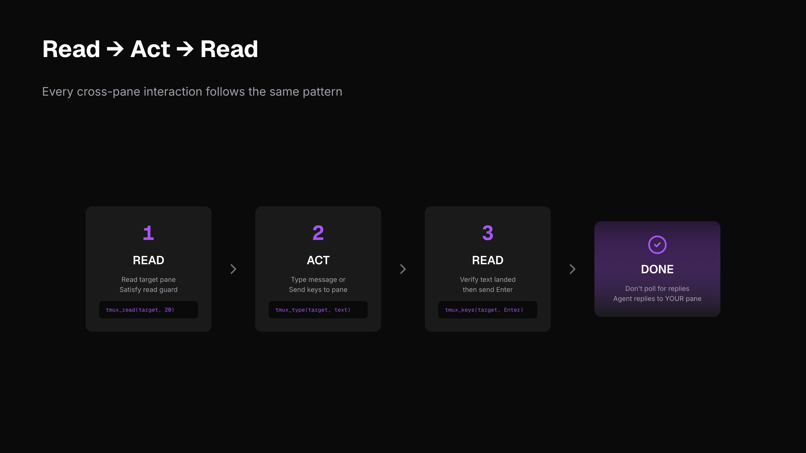
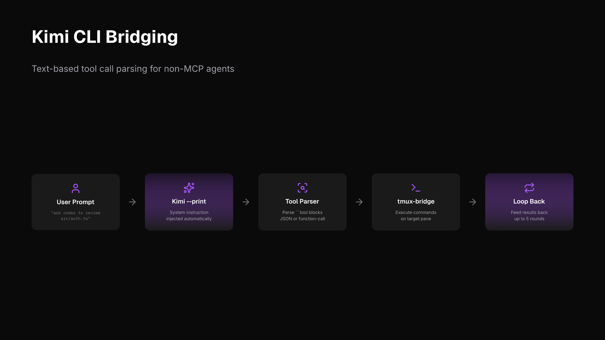

# tmux-bridge-mcp

**English** | [简体中文](README.zh-CN.md)



A standalone MCP server that lets AI agents (Claude Code, Gemini CLI, Codex, Kimi CLI) communicate with each other through tmux panes. It talks directly to tmux -- no external dependencies beyond tmux itself.

## 🖥️ What is tmux?

[tmux](https://github.com/tmux/tmux) is a **terminal multiplexer** -- it lets you split one terminal window into multiple **panes**, each running its own process independently. Think of it as "tabs on steroids" for your terminal.



```
+-------------------------------+
|  Pane 1       |  Pane 2       |
|  Claude Code  |  Codex        |
|  writing code |  reviewing    |
|               |               |
+---------------+---------------+
|  Pane 3       |  Pane 4       |
|  Gemini CLI   |  tail -f logs |
|  researching  |  monitoring   |
+-------------------------------+
```

Each pane is a full terminal. You can have Claude Code running in one, Codex in another, Gemini in a third -- all visible at the same time, all on the same machine.

**The problem:** these panes can't talk to each other. An agent in Pane 1 has no idea what's happening in Pane 2.



**tmux-bridge fixes this.** It gives every agent the ability to read, type, and send messages into any other pane.



## Controlled SSH shell panes

This fork also supports using tmux panes as controlled `ssh` shell targets, not just agent-to-agent chat panes.

- A pane labeled `ssh:xinong` or `ssh:ias` is treated as an `ssh-shell` pane
- A pane labeled `manual` is treated as a human-owned pane and is write-protected by default
- Agents still follow the same `tmux_read -> tmux_type -> tmux_read -> tmux_keys` workflow

Boundary control is intentionally simple and environment-driven:

- `TMUX_BRIDGE_READABLE_TARGETS`
  - comma-separated readable targets (`%pane`, `session:window`, or label)
- `TMUX_BRIDGE_WRITABLE_TARGETS`
  - comma-separated writable targets
- `TMUX_BRIDGE_READONLY_PATHS`
  - block writes when pane cwd starts with one of these prefixes
- `TMUX_BRIDGE_WRITABLE_PATHS`
  - if set, only allow writes when pane cwd is under one of these prefixes
- `TMUX_BRIDGE_DENY_PREFIXES`
  - dangerous command prefixes rejected for `ssh-shell` panes
- `TMUX_BRIDGE_ALLOW_MANUAL_WRITE=1`
  - opt out of the default write block for panes labeled `manual`

Example:

```bash
export TMUX_BRIDGE_WRITABLE_TARGETS="ssh:xinong,agent:codex"
export TMUX_BRIDGE_READONLY_PATHS="/,/etc,/usr,/var"
export TMUX_BRIDGE_WRITABLE_PATHS="/storage/public/home/2020060185"
export TMUX_BRIDGE_DENY_PREFIXES="rm -rf,sudo,reboot,shutdown"
```

## ⚡ What can you do with tmux-bridge?

Once installed, your AI agents can:

| Action | How | Example |
|--------|-----|---------|
| **See what another agent is doing** | `tmux_read` | Read the last 20 lines of Codex's pane |
| **Send a task to another agent** | `tmux_message` + `tmux_keys` | Tell Claude to review a file |
| **Coordinate multi-agent workflows** | Chain tool calls | Gemini researches -> Claude implements -> Codex reviews |
| **Monitor processes** | `tmux_read` on a shell pane | Watch build logs, test output, server status |
| **Label panes by role** | `tmux_name` | Name panes "claude", "codex", "gemini" for easy targeting |

All of this happens through standard MCP tool calls -- your agent doesn't need to learn any new syntax. If it supports MCP, it already knows how.

## 🤖 Supported Agents



### Tested and documented

| Agent | Connection | Status |
|-------|------------|--------|
| [Claude Code](https://docs.anthropic.com/en/docs/claude-code) | Native MCP (stdio) | Supported |
| [Gemini CLI](https://github.com/google-gemini/gemini-cli) | Native MCP (stdio) | Supported |
| [Codex CLI](https://github.com/openai/codex) | Native MCP (stdio) | Supported |
| [Kimi CLI](https://github.com/MoonshotAI/kimi-cli) v1.26+ | Native MCP (`kimi mcp add`) | Supported |
| [Kimi CLI](https://github.com/MoonshotAI/kimi-cli) older | Legacy wrapper (`kimi-tmux`) | Supported |

### Should work (any MCP-compatible agent)

| Agent | Notes |
|-------|-------|
| [Cursor](https://cursor.sh) | Supports MCP servers in settings |
| [Windsurf (Codeium)](https://codeium.com/windsurf) | MCP server support |
| [Copilot CLI](https://githubnext.com/projects/copilot-cli) | If MCP-compatible |
| [Aider](https://aider.chat) | Community MCP support |
| [Continue.dev](https://continue.dev) | MCP server support |
| [Cline](https://github.com/cline/cline) | VS Code extension with MCP |
| [Roo Code](https://github.com/RooVetGit/Roo-Code) | Fork of Cline with MCP |
| Any shell script or process | Read pane output with `tmux_read`, no MCP needed |

tmux-bridge works with **any agent that supports MCP over stdio**. If your agent isn't listed, try adding the MCP config -- it will likely just work.

## 💡 Why

When you run multiple AI agents in separate terminals, they work in isolation. You end up copy-pasting context between them, manually relaying questions and answers, or losing track of what each agent is doing.

tmux-bridge solves this by giving every agent the ability to **read, type, and send messages into any other terminal pane** -- programmatically, through standard MCP tool calls.

**Use cases:**

- **Code review pipeline** -- Claude Code writes code in one pane, Codex reviews it in another, results flow back automatically
- **Multi-model reasoning** -- ask Gemini for research, feed the findings to Claude, let Codex verify the implementation
- **Parallel workflows** -- multiple Claude Code instances each handling a different part of a large task, coordinating through pane messages
- **Monitoring** -- an agent reads log output from a `tail -f` pane and reacts to errors in real time

**What you need:**

| Requirement | Why |
|-------------|-----|
| **tmux** | The terminal multiplexer that hosts your panes -- this is the communication channel |
| **Node.js 18+** | Runs the MCP server |
| **At least one MCP-compatible agent** | Claude Code, Gemini CLI, Codex, or Kimi CLI v1.26+ |

If you already use tmux to run multiple agents side by side, tmux-bridge just makes them aware of each other.

### 😩 Without tmux-bridge

You're running Claude Code in one pane, Codex in another. Claude finishes writing a function and you want Codex to review it. Here's what actually happens:

1. You read Claude's output. Scroll up. Copy the relevant part.
2. Switch to Codex's pane. Paste it in. Type "review this code."
3. Codex gives feedback. You copy that.
4. Switch back to Claude. Paste Codex's feedback. "Fix these issues."
5. Repeat for every round of review.

**You are the message bus.** Every interaction flows through your clipboard. You're not writing code anymore -- you're routing context between agents. With 3+ agents running, this becomes unmanageable within minutes.

### 🤔 Why not LangChain / CrewAI / A2A?

| Approach | What it asks you to do | tmux-bridge difference |
|----------|----------------------|----------------------|
| **LangChain / CrewAI / AutoGen** | Rewrite your workflow inside their framework. Your agents must be Python objects in their orchestration layer. | You keep using Claude Code, Codex, Gemini CLI as-is. No framework, no SDK, no rewrite. |
| **Google A2A Protocol** | Wait for agents to adopt a new protocol spec. Designed for distributed, networked agents. | Works today with any MCP agent. No protocol adoption needed. |
| **Custom WebSocket / HTTP glue** | Build and maintain your own IPC layer. Handle serialization, discovery, error handling. | Zero infrastructure. tmux is the transport -- it's already running. |
| **Shared files / pipes** | Roll your own convention. Each agent needs custom tooling to read/write. | Standard MCP tools. Any agent that speaks MCP gets cross-pane superpowers instantly. |

**The key insight:** you don't need a multi-agent *framework*. You need your existing agents to *see each other*. tmux-bridge adds exactly that -- a thin MCP layer over tmux -- and nothing more.

## 🚀 Quick Start

**Prerequisites:** tmux 3.2+ and Node.js 18+ must be installed.

**One command to configure all your agents:**

```bash
npx tmux-bridge-mcp setup
```

This auto-detects Claude Code, Gemini CLI, Codex, and Kimi CLI on your machine, then writes the correct MCP config for each one. Done in seconds.

**Verify it works:**

```bash
npx tmux-bridge-mcp --help
```

You should see the version and available commands. Restart your AI agent to activate the new tools.

**See it in action:**

```bash
npx tmux-bridge-mcp demo
```

Opens a 3-pane tmux session and runs a live cross-pane communication demo.

<details>
<summary>Manual setup (if you prefer)</summary>

**1. Install tmux**

```bash
brew install tmux    # macOS
apt install tmux     # Linux
```

**2. Add to your agent's MCP config**

```json
{
  "mcpServers": {
    "tmux-bridge": {
      "command": "npx",
      "args": ["-y", "tmux-bridge-mcp"]
    }
  }
}
```

Restart your agent. It now has 9 MCP tools for cross-pane communication.

</details>

## 🔄 Updating

```bash
# If installed globally
npm update -g tmux-bridge-mcp

# If using npx (auto-updates, but to force latest)
npx tmux-bridge-mcp@latest

# Check your current version
npx tmux-bridge-mcp --version
```

After updating, restart your agents to pick up the new version. If you use `npx` in your MCP config, it caches the package — run `npx --yes tmux-bridge-mcp@latest` once to pull the latest, then your agents will use it on next startup.

## 🏗️ How It Works



tmux-bridge runs as an MCP server over stdio. It calls tmux directly (`capture-pane`, `send-keys`, `list-panes`, etc.) -- no intermediate CLI layer.

```
MCP path (Gemini, Claude Code, Codex, any MCP client):
+--------------+  MCP/stdio  +---------------+  tmux API  +--------------+
|  MCP Agent   |<----------->|  tmux-bridge  |<---------->|  tmux panes  |
+--------------+             |  MCP server   |            +--------------+
                             +---------------+

CLI path (Kimi):
+--------------+  --print    +---------------+  tmux API  +--------------+
|  Kimi CLI    |<----------->|  kimi-tmux    |<---------->|  tmux panes  |
+--------------+  tool parse |  adapter      |            +--------------+
                             +---------------+
```



All cross-pane interactions follow the **read-act-read** workflow:



| Step | Action | Purpose |
|------|--------|---------|
| 1 | `tmux_read` | Read target pane (satisfies read guard) |
| 2 | `tmux_message` / `tmux_type` | Type your message or command |
| 3 | `tmux_read` | Verify text landed correctly |
| 4 | `tmux_keys` | Press Enter to submit |
| -- | STOP | Don't poll. The other agent replies directly into your pane. |

The read guard is enforced at the MCP layer: `tmux_type`, `tmux_message`, and `tmux_keys` will fail unless you call `tmux_read` on the target pane first.

## ⚙️ Setup Per Agent

### Gemini CLI (native MCP)

Add to `~/.gemini/settings.json`:

```json
{
  "mcpServers": {
    "tmux-bridge": {
      "command": "npx",
      "args": ["tmux-bridge-mcp"]
    }
  }
}
```

### Claude Code (native MCP)

Add to your project's `.mcp.json` or global MCP config:

```json
{
  "mcpServers": {
    "tmux-bridge": {
      "command": "npx",
      "args": ["tmux-bridge-mcp"]
    }
  }
}
```

### Codex (native MCP)

Add to your MCP config following the Codex MCP setup docs:

```json
{
  "mcpServers": {
    "tmux-bridge": {
      "command": "npx",
      "args": ["tmux-bridge-mcp"]
    }
  }
}
```

### Kimi CLI

```bash
# Check your Kimi version
kimi --version
# v1.26+ → use native MCP (recommended)
# older  → use kimi-tmux wrapper
```

**Native MCP (recommended, v1.26+):**

```bash
kimi mcp add tmux-bridge -- npx tmux-bridge-mcp
```

Once added, Kimi uses all tmux-bridge tools directly -- no adapter needed.

**Legacy wrapper (older versions):**

For Kimi CLI versions without native MCP, `kimi-tmux` bridges the gap by injecting the system instruction as a prompt, running Kimi in `--print` mode, parsing tool-call blocks from output, and executing them via tmux.

```bash
kimi-tmux "list all tmux panes"
kimi-tmux "ask the agent in codex pane to review src/auth.ts"
kimi-tmux "read what claude is working on"
kimi-tmux --rounds 3 "send a message to gemini and wait for the result"
```



## 🔧 Tools Reference

| Tool | Description |
|------|-------------|
| `tmux_list` | List all panes with target ID, process, label, and working directory |
| `tmux_read` | Read last N lines from a pane (satisfies read guard) |
| `tmux_type` | Type text into a pane without pressing Enter (requires prior read) |
| `tmux_message` | Send message with auto-prepended sender info (requires prior read) |
| `tmux_keys` | Send special keys -- Enter, Escape, C-c, etc. (requires prior read) |
| `tmux_name` | Label a pane for easy targeting (e.g., "claude", "gemini") |
| `tmux_resolve` | Look up pane ID by label |
| `tmux_id` | Print current pane's tmux ID |
| `tmux_doctor` | Diagnose tmux connectivity issues |

Targets can be a pane ID (`%0`), session:window.pane (`main:0.1`), or a label (`claude`, `agent:codex`, `ssh:xinong`, `manual`).

`tmux_list` now also reports a pane kind:

- `agent`
- `ssh-shell`
- `manual`
- `unknown`

Recommended workflow for `ssh-shell` panes:

1. `tmux_read(target="ssh:xinong", lines=40)`
2. `tmux_type(target="ssh:xinong", text="tail -n 50 job.log")`
3. `tmux_read(target="ssh:xinong", lines=5)`
4. `tmux_keys(target="ssh:xinong", keys=["Enter"])`

## 📖 Examples

### Ask Claude to review a file (from Gemini)

```
tmux_list()
tmux_read(target="claude", lines=20)
tmux_message(target="claude", text="Please review src/auth.ts for security issues")
tmux_read(target="claude", lines=5)
tmux_keys(target="claude", keys=["Enter"])
```

### Multi-agent coordination (from Kimi)

```bash
kimi-tmux "tell the claude pane to run the test suite"
kimi-tmux "ask gemini to summarize the test results in claude's pane"
```

### Multi-agent layout

```
+-----------------------------------------------------------+
| tmux session                                              |
|                                                           |
| +------------+ +------------+ +----------+ +-----------+  |
| | Claude Code | |   Codex    | | Gemini   | |   Kimi    | |
| |  (MCP)     | |  (MCP)     | |  (MCP)   | |(kimi-tmux)| |
| |            | |            | |          | |           |  |
| | label:     | | label:     | | label:   | | label:    |  |
| | claude     | | codex      | | gemini   | | kimi      |  |
| +-----+------+ +-----+------+ +----+-----+ +-----+-----+ |
|       +---------------+-----------+--------------+        |
|           tmux-bridge (direct tmux IPC, no deps)          |
+-----------------------------------------------------------+
```

## 🌐 Environment Variables

| Variable | Description | Default |
|----------|-------------|---------|
| `TMUX_BRIDGE_SOCKET` | Override tmux server socket path | Auto-detected from `$TMUX` |
| `KIMI_PATH` | Path to `kimi` binary (kimi-tmux only) | `kimi` (in PATH) |

## 🔒 Security Model

tmux-bridge is designed for **local development on a single machine**. It assumes all connected MCP agents are trusted:

- Any agent can read from or write to **any pane** in the tmux server — there is no per-pane access control.
- The **read guard** (must `tmux_read` before `tmux_type`/`tmux_keys`) is a sequencing aid to prevent blind typing. It is **not a security boundary**.
- Pane labels set via `tmux_name` are **not authenticated** — any agent can label or relabel any pane.
- There is no encryption or authentication between agents. Communication happens through tmux's own IPC (Unix socket).

**Do not use tmux-bridge in multi-tenant environments** or expose the tmux socket over a network. It is built for the common case: one developer running multiple AI agents side by side on their own machine.

## 📝 System Instruction

For agents that support custom system prompts, use `system-instruction/smux-skill.md`. It teaches the read-act-read workflow and documents all available MCP tools.

## 🔗 Related Projects

| Project | Approach | Focus |
|---------|----------|-------|
| [smux](https://github.com/ShawnPana/smux) | tmux skill + bash CLI | Agent-agnostic tmux setup |
| [agent-bridge](https://github.com/raysonmeng/agent-bridge) | WebSocket daemon + MCP plugin | Claude Code <-> Codex |
| **tmux-bridge-mcp** (this) | Standalone MCP server + direct tmux | Any agent, zero deps beyond tmux |

### smux vs tmux-bridge-mcp

| Dimension | smux | tmux-bridge-mcp (this) |
|-----------|------|------------------------|
| 🔌 **How agents connect** | Agent runs bash commands (`tmux-bridge read/type/keys`) | Agent uses MCP tool calls (`tmux_read/tmux_type/tmux_keys`) |
| 🚀 **Agent onboarding** | Install skill or inject system prompt to teach bash commands | Add MCP config JSON -- agent auto-discovers 9 tools |
| 📦 **Prerequisites** | `curl \| bash` installs tmux + tmux.conf + CLI script | Just tmux + Node.js, `npx` to run |
| ⚙️ **tmux configuration** | Ships full tmux.conf (keybindings, mouse, status bar) | Doesn't touch tmux.conf -- no config conflicts |
| 🛡️ **Read guard** | Bash CLI layer (`/tmp` file lock) | MCP server layer (`/tmp` file lock, same concept) |
| 💻 **Language** | Bash (~300 LOC) | TypeScript (~600 LOC) |
| 📥 **Install** | `curl \| bash`, writes to `~/.smux/` | `npm install -g` or `npx` |
| 🤝 **Agent compatibility** | Any agent that can run bash (needs skill/prompt) | Any agent with MCP support (standard protocol) |

👉 **When to use smux:** You want a complete tmux setup (keybindings, mouse support, status bar) and your agents support the skills system or you're comfortable injecting system prompts.

👉 **When to use tmux-bridge-mcp:** You want a drop-in MCP server that works with any MCP-compatible agent out of the box, without touching your tmux configuration.

### tmux-bridge (`/tmb`) vs Claude Code Native (subagent + `/codex` + `/gemini`)

| Dimension | tmux-bridge | Claude Code Native |
|-----------|-------------|-------------------|
| **Context isolation** | Each pane has its own full conversation context, persists across interactions | subagent spawns fresh each time, gone when it finishes |
| **Persistence** | Pane stays alive, accumulates conversation history | Fire-and-forget, must re-provide context next time |
| **Parallelism** | Truly independent processes, no interference | Agent tool can parallelize, but shares billing/rate limits |
| **Model diversity** | Each pane can run a different CLI (Codex, Gemini, Kimi) | `/codex` `/gemini` can do this too -- not a real differentiator |
| **Communication overhead** | Goes through tmux read/send, has latency, messages may get truncated | Native tool calls, structured returns, high reliability |
| **Result integration** | You must read pane output, parse, and synthesize manually | subagent returns structured results directly, ready to use |
| **Operational complexity** | Extra layer of tmux management (labels, pane IDs) | One tool call, done |
| **Cost** | Each pane consumes its own token budget independently | subagent shares the same session's token pool |

**Verdict**

tmux-bridge's real advantage comes down to one thing: **persistent context**. If you need an agent that remembers the last 30 turns of conversation and keeps following up on the same task, a tmux pane can do that -- a subagent cannot.

But for most tasks, native is better:
- Communication is more reliable (no tmux buffer truncation)
- Results are structured -- no need to parse terminal output
- Simpler to operate, one less layer of abstraction

**Practical guidance:**
- **Short-lived, one-off tasks** → native subagent / `/codex` / `/gemini`
- **Long-running sessions that need accumulated context** (e.g., a reviewer continuously following the same PR) → tmux-bridge adds real value
- A multi-pane multi-role layout only pays off if each role genuinely needs cross-conversation state -- otherwise the overhead outweighs the benefit

## 📄 License

MIT
